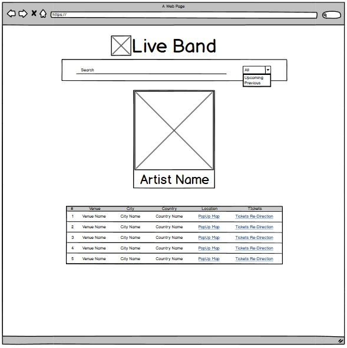
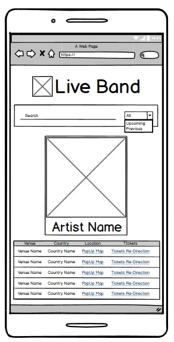

# Interactive Frontend Development Milestone Project
## Live Band

This website is connected to two API's, the first one is the [Bandsintown REST API](https://www.bandsintown.com/) , which is use to fetch the information which will be displayed on a table. The second API used in this project is [Google Maps API](https://cloud.google.com/maps-platform/).

### Purpose
The purpose of this project is to show the skills gain through out the course at this point and during the development of this project. 
Thi is a non-profit project, reason why each ticket link targets to a new tab/window to [bandsintown](https://www.bandsintown.com/) artist link.

### Technologies
* HTML
* CSS
* JS

### Libraries
* Handlebars
* Colorbox
* Lodash
* Materialize
* jQuery

### API's
* Google Maps
* Bands in town API

### UX with Responsive design
In the tablet/desktop version, is easy to see all the rows of the table.

| # | Venue | City | Country | Location | Tickets |
|---|-------|------|---------|----------|---------|

In the mobile version, the table change to make it easy to read on small devices such as smartphones, keeping location due to it is a small icon and when clicked pop-up the map where the venue is located, and last the ticket link which openes a new tab on the browser to get the tickets of the event.

| Venue | Country | Location | Tickets |
|-------|---------|----------|---------|

### Deployment
The project was developed using Visual Studio Code and for version control used Github Desktop, a github desktop aplication which makes committing and pushing the changes easier to github where the peoject is hosted.
This application is live and hosted in GitHub pages, deployed from the master branch. The landing page is the index.html file in order to make it live. Everytime a change is being done and commit to the project it will be reflected.

### Testing
The application was tested on Chrome desktop version, changing the view port size using the developers tools of the web browser, also chrome web version on a Samsung Galaxy Note 10 and a Samsung Galaxy Note 8. 

### Features
#### Fueatures left to implement
Implementing Spotify in this project was complicated with my knowledge gain at this point, for that reason I decided to left it for as a feature implementation to complement the project.

On the country row of the table will be added a filter, to be able to display just the countries the end user is interested on.

### Credits
Special thanks to [Bandsintown](http://corp.bandsintown.com) for letting me use thier API and achive this project.